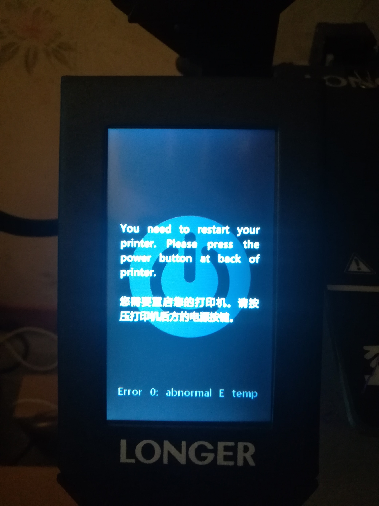

# Longer 3D LK4 Pro


## Cura 4.4

### Printer settings
_Custom printer_
````
X(Width): 220 mm
Y(Depth): 220 mm
Z(Width): 250 mm

Heated bed [X] 
````

### Start G-code

Add `G90` code at the beginning
````
G90
G28 ;Home
G1 Z15.0 F6000 ;Move the platform down 15mm
[...]
````

### Extruder settings

````
Nozzle size: 0.4 mm
Material diameter: 1.75 mm
````
## Firmware updates

Motherboard firmware updates can be done with Cura in _Printer settings > Upload firmware_.

* [0.3.2](./files/LK4_Pro0.3.2.hex)  
    _Changelog_
    ````
    ...
    ````


## Issues

- Random abnormal temperature error
    
- Very noisy fans

## Resources

Longer LK4 Pro files : https://drive.google.com/drive/folders/1dvHLv4zWOcAh2wGPTkmM-cPpN2BUfJWg
